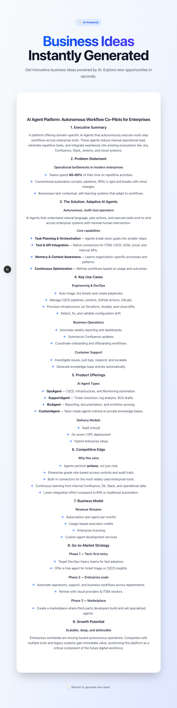

# AI_Project — Business Idea Generator

> Next.js (App Router) + Tailwind CSS v4 + FastAPI + SSE + Markdown + CI/CD

A compact, production-minded full‑stack demo that streams AI-generated business ideas (SSE) from a FastAPI backend into a Next.js frontend. Includes local dev instructions, Docker Compose for optional integration testing, and CI/CD notes for Jenkins + Ansible.

---

## Table of Contents

1. [About](#about)
2. [Prerequisites](#prerequisites)
3. [Project layout](#project-layout)
4. [Backend — local setup & run](#backend--local-setup--run)
5. [Frontend — local setup & run](#frontend--local-setup--run)
6. [Docker — build images locally](#docker-build-images-locally)
7. [Optional: Local integration with Docker Compose](#optional-local-integration-with-docker-compose-single-host)
8. [CI/CD (Jenkins + Ansible)](#cicd-jenkins--ansible)
9. [Run both services locally (developer convenience)](#run-both-services-locally-developer-convenience)
10. [Troubleshooting](#troubleshooting)
11. [Contributing / Next steps](#contributing--next-steps)

---

## About

This repo demonstrates a modern stack for building an internal or SaaS tool that:

- Streams AI outputs via Server-Sent Events (SSE).
- Renders Markdown in the browser (ReactMarkdown).
- Uses Tailwind v4 for styling and a Next.js App Router frontend.
- Is CI/CD-ready (Jenkins + Ansible) and container-friendly.

---

## Prerequisites

Install or confirm these tools locally:

```bash
node -v   # Node.js 18+
npm -v
python -V # Python 3.10+
pip -V
docker -v # for optional local integration
```

You also need an OpenAI API key for the backend to generate content.

---

## Project layout

```
AI_Project/
├─ backend/                    # FastAPI app, Dockerfile, requirements.txt
├─ frontend/                   # Next.js app (app/), Tailwind, Dockerfile
├─ infra/ansible/              # Ansible inventory & playbooks
├─ Jenkinsfile                 # Multibranch pipeline (GitFlow-aware)
├─ ci/CD_README.md             # CI/CD integration notes
└─ README.md                   # This file
```

---

## Backend — local setup & run

1. Create and activate a venv (optional but recommended):

```bash
cd backend
python -m venv .venv
source .venv/bin/activate   # macOS/Linux
# .\.venv\Scripts\activate # Windows (PowerShell)
```

2. Install dependencies:

```bash
pip install -r requirements.txt
```

3. Add environment variables (create `backend/.env`):

```
OPENAI_API_KEY=sk-...your-key...
APP_ENV=local
```

> **Security:** Never commit real secrets. Commit `backend/.env.sample` with placeholders.

4. Run the API locally:

```bash
uvicorn main:app --reload --host 0.0.0.0 --port 8000
```

5. Test the SSE endpoint:

```bash
curl -N http://localhost:8000/stream
```

Notes:
- `backend/main.py` ships with permissive CORS for dev; lock this down in production.

---

## Frontend — local setup & run

1. Install dependencies:

```bash
cd frontend
npm install
# or pnpm install
```

2. Create `frontend/.env.local` to point to the backend:

```
NEXT_PUBLIC_API_BASE_URL=http://localhost:8000
```

3. Start dev server:

```bash
npm run dev
```

Open: `http://localhost:3000`

Notes on Tailwind v4:
- Ensure `tailwind.config.js` content globs include `./app/**/*.{js,ts,jsx,tsx,mdx}`.
- `postcss.config.mjs` must include the `@tailwindcss/postcss` plugin for v4.
- Restart the dev server after changes.

---

## Docker: build images locally

From repository root you can build both images:

```bash
docker build -t myrepo/ai_project_backend:latest ./backend
docker build -t myrepo/ai_project_frontend:latest ./frontend
```

Push images to your registry before deploying from CI.

---

## Optional: Local integration with Docker Compose (single-host)

This is an **optional** integration harness to run the frontend, backend, a Jenkins instance, and a lightweight Tower mock locally for integration testing.

**Files to add to repo root**

**`docker-compose.yml`**

```yaml
version: "3.8"

services:
  backend:
    build:
      context: ./backend
      dockerfile: Dockerfile
    image: ai_project_backend:local
    depends_on:
      - tower-mock
    working_dir: /app
    volumes:
      - ./backend:/app:ro
      - ./backend/.env:/app/.env:ro
    ports:
      - "8000:8000"
    healthcheck:
      test: ["CMD", "curl", "-f", "http://localhost:8000/health || exit 1"]
      interval: 10s
      retries: 5

  frontend:
    build:
      context: ./frontend
      dockerfile: Dockerfile
    image: ai_project_frontend:local
    depends_on:
      - backend
    working_dir: /app
    volumes:
      - ./frontend:/app:ro
      - ./frontend/.env.local:/app/.env.local:ro
    ports:
      - "3000:3000"
    command: >
      sh -c "npm install --no-audit --no-fund && npm run dev -- --hostname 0.0.0.0"
    environment:
      - NEXT_PUBLIC_API_BASE_URL=http://host.docker.internal:8000

  jenkins:
    image: jenkins/jenkins:lts
    user: root
    restart: unless-stopped
    ports:
      - "8080:8080"
      - "50000:50000"
    volumes:
      - jenkins_home:/var/jenkins_home
    healthcheck:
      test: ["CMD", "curl", "-f", "http://localhost:8080/login || exit 1"]
      interval: 30s
      retries: 10

  tower-mock:
    image: kennethreitz/httpbin
    ports:
      - "8888:80"
    environment:
      - BASIC_AUTH=off

volumes:
  jenkins_home: {}
```

**`.env` examples** (do NOT commit secrets)

`backend/.env`

```
OPENAI_API_KEY=sk-...your-key...
APP_ENV=local
LOG_LEVEL=debug
```

`frontend/.env.local`

```
NEXT_PUBLIC_API_BASE_URL=http://localhost:8000
```

**Makefile snippets (repo root)**

```makefile
.PHONY: dev compose-up compose-down compose-logs build-images

dev: compose-up
	@echo "Dev stack started. Frontend: http://localhost:3000 | Backend: http://localhost:8000"

compose-up:
	docker-compose up --build -d

compose-down:
	docker-compose down --volumes --remove-orphans

compose-logs:
	docker-compose logs -f

build-images:
	docker-compose build --parallel
```

**Quick usage**

```bash
# start
make dev
# view logs
make compose-logs
# stop
make compose-down
```

**Notes & troubleshooting**
- Jenkins first boot is slow (1–5 minutes). Check logs.
- If `host.docker.internal` is unavailable on Linux, add `extra_hosts: - "host.docker.internal:host-gateway"`.
- `httpbin` is a lightweight Tower/AWX mock — full AWX is heavy and not included here.

---

## CI/CD (Jenkins + Ansible)

- `Jenkinsfile` is multibranch and GitFlow-aware.
- Pipeline stages tag images by `${BRANCH}-${BUILD_NUMBER}` for traceability.
- Jenkins credentials used by the pipeline (set in Jenkins):
  - `DOCKER_REGISTRY` (secret text)
  - `docker-hub-credentials` (username/password)
  - `ansible-ssh-creds` (SSH private key)

Ansible playbooks live under `infra/ansible/` and the deploy playbook uses `community.docker` to pull and run containers on remote hosts.

---

## Run both services locally (developer convenience)

Open two terminals:

**Terminal 1 — Backend**

```bash
cd backend
source .venv/bin/activate
uvicorn main:app --reload --port 8000
```

**Terminal 2 — Frontend**

```bash
cd frontend
npm install
npm run dev
```

---

## Troubleshooting

- `Cannot find module '@tailwindcss/postcss'`: run `npm install` in `frontend/` and ensure `@tailwindcss/postcss` is in `devDependencies`.
- `Cannot apply unknown utility class`: ensure Tailwind `content` globs include files using `@apply` and restart dev server.
- SSE not streaming: verify `NEXT_PUBLIC_API_BASE_URL` and that no proxy is blocking EventSource.

---

## Contributing / Next steps

- Add `docker-compose.override.yml` or Docker Compose profiles so contributors can enable/disable services.
- Add an example AWX job template JSON and a `curl` launch snippet (docs/awx).
- Add `backend/.env.sample` and `frontend/.env.local.sample` with placeholders.
- Consider adding a `scripts/` directory with helper scripts to bootstrap local state.

---

## Screenshot



---

**That's it.** This README is ready for contributors: it documents local dev, optional Docker Compose integration, and CI/CD pointers.
